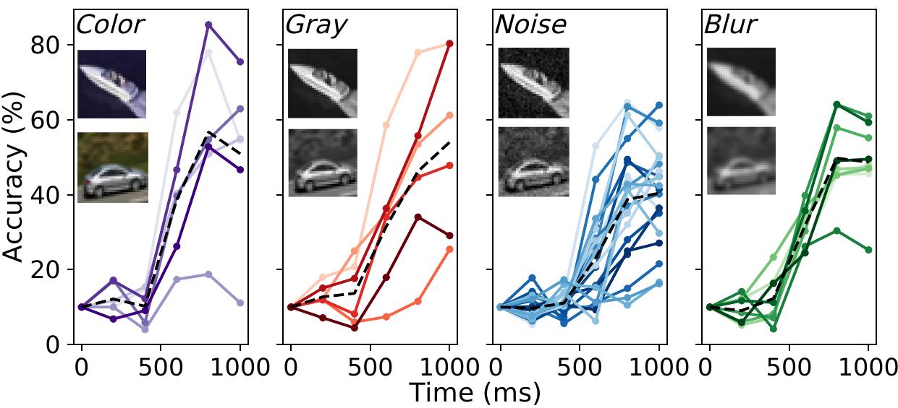

# SATBench: A Benchmark of the Human Speed-Accuracy Tradeoff in Recognizing Objects

**This repository contains code and data used in the paper:**

*"SATBench: A Benchmark of the Human Speed-Accuracy Tradeoff in Recognizing Objects" by Ajay Subramanian, Omkar Kumbhar, Elena Sizikova, Najib J. Majaj, Denis Pelli (New York University).*

We present a benchmark, a speed-accuracy trade-off in human performance, with various image perturbations (grayscale conversion, noise, and blur). We also evaluate the ability of several dynamic neural networks to mimic human speed-accuracy trade-offs using similar images and perturbations.



## Table of Contents
1. Dataset
2. Code
3. Usage examples
4. Pretrained models
4. Citation
5. References

## Dataset
We present a dataset which reports human performance as a function of reaction time on CIFAR-10 images. Subjects were asked to perform image classification on CIFAR-10 [4] using a fixed reaction time. Data is reported for 5 reaction time blocks: `200ms`, `400ms`, `600ms`, `800ms`, and `1000ms`. This procedure was repeated for 4 different image manipulations: grayscale, color, Gaussian noise, Gaussian Blur. **For the data files, visualization notebooks and a more detailed explanation, please see `human_data/`**.

Data URL: https://osf.io/zkvep/

## Code
We benchmark 3 dynamic neural network models - MSDNet [1] , SCAN [2] and rCNN [3] (referred to in our paper as ConvRNN) on our dataset. The following table mentions the scripts to be used for training and inference of each model. **We used code for each model from existing/official implementations (links given below):**

MSDNet: https://github.com/kalviny/MSDNet-PyTorch

SCAN: https://github.com/ArchipLab-LinfengZhang/pytorch-scalable-neural-networks

ConvRNN: https://github.com/cjspoerer/rcnn-sat


| Model   | Root directory | Gray             |                 | Noise            |                 | Blur            |                | Color            |                 |
|---------|----------------|------------------|-----------------|------------------|-----------------|-----------------|----------------|------------------|-----------------|
|         |                | Train            | Inference       | Train            | Inference       | Train           | Inference      | Train            | Inference       |
| MSDNet  | `msdnet`       | `train.py`       | `test.py`       | `train.py`       | `test.py`       | `train.py`      | `test.py`      | `train.py`       | `test.py`       |
| SCAN    | `scan`         | `train_color.py` | `test_color.py` | `train_noise.py` | `test_noise.py` | `train_blur.py` | `test_blur.py` | `train_color.py` | `test_color.py` |
| ConvRNN | `convrnn`      | `train_color.py` | `test_color.py` | `train_noise.py` | `test_noise.py` | `train_blur.py` | `test_blur.py` | `train_color.py` | `test_color.py` |

## Usage examples
### MSDNet
```
cd msdnet
```

1. Train MSDNet-S on grayscale CIFAR-10 with Gaussian noise of random batch standard deviation in [0.0, 0.04]
```
python -u train.py --tag gray-noise --data-root ../data/ --mode 'noise' --depth 's'
```

2. Test MSDNet-L on grayscale CIFAR-10 with Gaussian blur of standard deviation 0.06
```
python -u test.py --tag gray-blur --data-root ../data/ --load-path <PATH/TO/MODEL>.pth --mode blur --pert_std 0.06 --depth 'l'
```

### SCAN
```
cd scan
```

1. Train SCAN-R18 on grayscale CIFAR-10 with Gaussian blur of random batch standard deviation in [0.0, 0.9]
```
python -u train_blur.py --tag gray-blur --data-root ../data/ --depth 18 -- class_num 10 --blur-std 0.9
```

1. Test SCAN-R34 on grayscale CIFAR-10 with no perturbation
```
python -u test_color.py --tag gray --data-root ../data/ --depth 34 --class_num 10 --color gray
```

### ConvRNN
```
cd convrnn
```

1. Train ConvRNN on grayscale CIFAR-10 with Gaussian noise of random batch standard deviation in [0.0, 0.07]
```
python -u train_noise.py --tag gray-noise --download-data True --pretrained True
```

2. Test ConvRNN on grayscale CIFAR-10 with Gaussian blur of 1.25 standard deviation
```
python -u test_blur.py --tag gray-blur --load_path <PATH/TO/MODEL.h5>
```

## Pretrained models
Pretrained models for all experiments are given here: [MSDNet](https://drive.google.com/drive/folders/1YIAajOhUNyfoPGmjX8oyNyUVyjpmYbOB?usp=sharing), [SCAN](https://drive.google.com/drive/folders/1Hcx2bNP8ZVr3lIEYEwJwy_OFXP7CrTk3?usp=sharing), [ConvRNN](https://drive.google.com/drive/folders/1ILC4DvqywcyrvgTKfdgWyAJLCMm9BxGp?usp=sharing). These can be loaded and used to run inference as given in the previous section.

## Citations
If you use any of the data present on this repository, please check citations on: https://osf.io/zkvep/

## References
1. *Huang, Gao, et al. "Multi-scale dense convolutional networks for efficient prediction." arXiv preprint arXiv:1703.09844 2 (2017).*
2. *Zhang, Linfeng, et al. "SCAN: A scalable neural networks framework towards compact and efficient models." arXiv preprint arXiv:1906.03951 (2019).*
3. *Spoerer, Courtney J., et al. "Recurrent neural networks can explain flexible trading of speed and accuracy in biological vision." PLoS computational biology 16.10 (2020): e1008215.*
4. *Krizhevsky, Alex, and Geoffrey Hinton. "Learning multiple layers of features from tiny images." (2009)*
